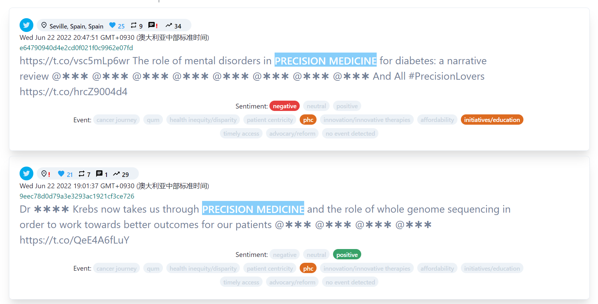
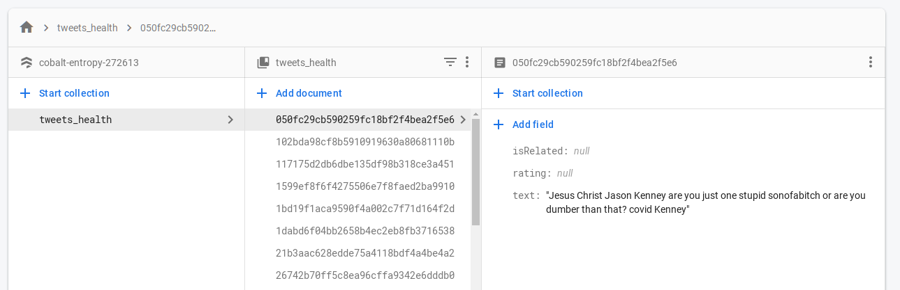

# Sentiment-event-labelling-tool


### Table of Contents

* [Label-tool](#Label-tool)
* [Scrapper](#Scrapper)
* [Sentiment analysis](#Sentiment-analysis)
* [Event detection](#Event-detection)
* [Docker](#Docker)


## Label-tool

### Install
[npm](https://www.npmjs.com/):

```sh
npm install 
```

```bash
npm run dev
# or
yarn dev
```
Open [http://localhost:3000](http://localhost:3000) with your browser to see the result.

You can start editing the page by modifying `pages/index.js`. The page auto-updates as you edit the file.

[API routes](https://nextjs.org/docs/api-routes/introduction) can be accessed on [http://localhost:3000/api/hello](http://localhost:3000/api/hello). This endpoint can be edited in `pages/api/hello.js`.

The `pages/api` directory is mapped to `/api/*`. Files in this directory are treated as [API routes](https://nextjs.org/docs/api-routes/introduction) instead of React pages.

### Workflow of label tool
#### 1. Scrap data from social media
- [x] This project will collect data from:
  - [x] Twitter:
    - [x] Tweets with specifice keywords and/or hashtags
      - [x] dynamic keywords and/or hashtags
      - [x] Tweet's text
      - [x] Tweet's account id
      - [x] Tweet's post time
      - [x] Tweet's original link
      - [x] Tweet's replies
      - [x] Tweet's retweet
      - [x] Tweet's likes
      - [x] Combination of above-mentioned tweet's features
    - [x] Tweets from specific accounts
      - [x] dynamic accounts list
      - [x] Tweet's text
      - [x] Tweet's account id
      - [x] Tweet's post time
      - [x] Tweet's original link
      - [x] Tweet's replies
      - [x] Tweet's retweet
      - [x] Tweet's likes
      - [x] Combination of above-mentioned tweet's features
    - [x] Searching condition
      - [x] number restriction
      - [x] time span restriction
      - [x] premium search option
      - [x] searching or prediction count restriction
### Label app component
- [x] Summary page:
  - [x] Print real time prediction result shown by line chart and bart chart
- [x] Annotation page:
  - [x] Implement manual annotation for keyword searching and user account searching
- [x] Prediction page
  - [x] Implement real time prediction for keyword searching and user account searching through sentiment 
pretrained analysis model and event detection model.
- [x] Download page
  - [x] Download the annotation data for the current login user
- [x] Admin page
  - [x] Download the predefined keywords
  - [x] Add keywords and events

      
    
- [x] Build web app that:
  - [x] Support log in
  - [x] Support run modes:
    - [x] Filter by list of account Ids
    - [x] Filter by list keywords
  

  - [x] Load storing unlabelled data
  - [x] Update rating as 3 labels: negative, neutral, possitive
  - [x] Update rating as all the  event labels
  - [x] Mask all the twitter handle, human name, phone number, and personal address.

 
### Learn More

To learn more about Next.js, take a look at the following resources:

- [Next.js Documentation](https://nextjs.org/docs) - learn about Next.js features and API.
- [Learn Next.js](https://nextjs.org/learn) - an interactive Next.js tutorial.

You can check out [the Next.js GitHub repository](https://github.com/vercel/next.js/) - your feedback and contributions are welcome!

### Dependencies

* Selenium
    ```
    pip install selenium
    ```
    [setup instruction](https://selenium-python.readthedocs.io/installation.html)
  

## Scrapper

###  FastAPI
FastAPI is a modern, fast (high-performance), web framework for building APIs with Python 3.6+ based on standard Python type hints
It always with Very high performance, on par with NodeJS and Go (thanks to Starlette and Pydantic). [One of the fastest Python frameworks available](https://fastapi.tiangolo.com/#performance).

We will deploy the fast api application on the localhost:8000 as the default port.

* 
  ```
  pip install fastapi
  ```
  You can also check [How to start by using fast api](https://fastapi.tiangolo.com/)


* RUN THE following command in the CMD will deploy the whole application
* 
  ```
  uvicorn --host 0.0.0.0 --port 8000 fast:app --reload
  ```
  You can also check [How to start by using fast api](https://fastapi.tiangolo.com/)


### Store online
We store all the scrappered data in the firebase database, firebase database The Firebase Realtime Database is a cloud-hosted database. Data is stored as JSON and synchronized in realtime to every connected client. When you build cross-platform apps with our Apple platforms, Android, and JavaScript SDKs, all of your clients share one 
Realtime Database instance and automatically receive updates with the newest data.

* Firebase
    ```
    pip install --upgrade firebase-admin
    ```
    [Setup instruction](https://firebase.google.com/docs/firestore/quickstart#python)


#### Collected data
-  Collected data will be stored in [this Google's Firestore project](https://console.firebase.google.com/u/0/project/cobalt-entropy-272613/firestore/). You will need permission for accessing it. Current data structure is ```outdated```:

> `tweets_health` collection name
> > `id` data.text's MD5 hash
> >> `isRelated` `= null` indicates this text is related to health topic \
> \
> >> `rating` `=null` -2 (very negative), -1(negative), 0 (neutral), 1(possitive) 2 (very possitive) \
> \
> >> `text` collected data


 
## Deep learning with Bert for sentiment analysis and event detection

<p align="center" width="100%">
    
</p>

###[BERT](https://github.com/google-research/bert)

BERT, which stands for Bidirectional Encoder Representations from Transformers, 
is based on Transformers, a deep learning model in which every output element is 
connected to every input element, and the weightings between them are dynamically 
calculated based upon their connection. BERT was pretrained on two tasks: language modelling (15% of tokens were masked and BERT was trained to predict them from context) and next sentence prediction (BERT was trained to predict if a chosen next sentence was probable or not given the first sentence). As a result of the training process, BERT learns contextual embeddings for words. After pretraining, which is computationally expensive, BERT can be finetuned with less resources on smaller datasets to optimize its performance on specific tasks.

####[Learn more](https://arxiv.org/abs/1810.04805)

## Sentiment analysis

With three labels (negative,positive,neutral)

We deploy our fine-tuned Bert model by Fast api you can first download it and run it on the 
default port 8001.
You need to enter the sa folder and run the following command to create the 'models' foler

   ```
     mkdir models
   ```
Then, going directly to the mdoels folder and run


   ```
    gdown --id 1cumVQw4c8FbnZIQO2pW1yF_GBM9e4v3n -O ./models/sa_best_model_state.bin
   ```
Following command is required in order to run fast api

  ```
   uvicorn --host 0.0.0.0 --port 8001 fast_sa2:app --reload
  ```


## Event detection

With event labels (Timely access, health, food, phc, patient, centricity, innovation, innocative therapies, advocary/reform, affordability, health inequity/disparity and initiatives/education.)

We deploy our fine-tuned Bert model by Fast api you can first download it and run it on the 
default port 8002.

You need to enter the ed folder and run the following command to create the 'models' foler

   ```
     mkdir models
   ```
Then, going directly to the mdoels folder and run


   ```
    gdown --id 1cP2DMfSFbDSwUm3YGMTQOh6C535vGL2w modelID -O ./models/ed_best_model_state.bin
   ```
Following command is required in order to run fast api

  ```
   uvicorn --host 0.0.0.0 --port 8002 fast_ed2:app --reload
  ```

# [Docker](https://hub.docker.com/)

For convenience and handle incompatibility issue. we use docker to deploy the label tool,
scrapper, models by docker. Since we have already finished writing docker file. you just 
need to going to the ground folder of each component(label tool,scrapper,ed,sa) then run the
following command, you are able to build your own images.

 ```
   sudo docker build -t [dockerfile-name]:[tag] .
 ```
